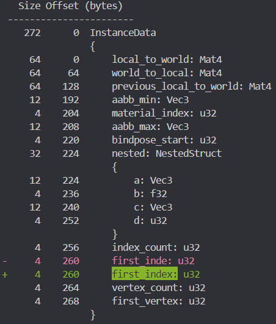

## dyn_pod_struct

## Very WIP

Quick overview:

A runtime [Pod](<https://docs.rs/bytemuck/latest/bytemuck/trait.Pod.html>) struct with a dynamic layout (`DynLayout`) (somewhat like bevy's [DynamicStruct](<https://docs.rs/bevy_reflect/latest/bevy_reflect/struct.DynamicStruct.html>) but designed around primarily trying to be fast, taking advantage that the data is `Pod` and supporting granular change detection). 

There's a `DynLayout` derive to generate the layout from a rust `Pod` struct at compile time, and there's also a function to generate a `DynLayout` using spirv reflection.

It both has its own form of reflection and it also partially implements `Reflect` from bevy. (`DynStruct` supports nested structs but I haven't figured out how to adapt this properly to bevy's corresponding impl in `Reflect` yet)

You can use `bytemuck` to safely cast the whole struct to something on the rust side (which also has reflection) or you use `&str` to access fields, or you can use `&str` to get a `DynField` which contains the offset into the buffer and then repeatedly access some field across a set of structs with the same layout, which is quite fast.

With `DynStruct`'s reflection you can check if two struct layouts are `Eq`, and you can diff the layouts.

There's also a `TrackedDynStruct` that adds granular change detection. It tracks mutable access to regions of the `DynStruct`'s data (with a user defined stride) to allow the render pipeline to only upload changed regions to the GPU.

[diff_display example:](https://github.com/DGriffin91/dyn_pod_struct/blob/main/examples/diff_display.rs) 

